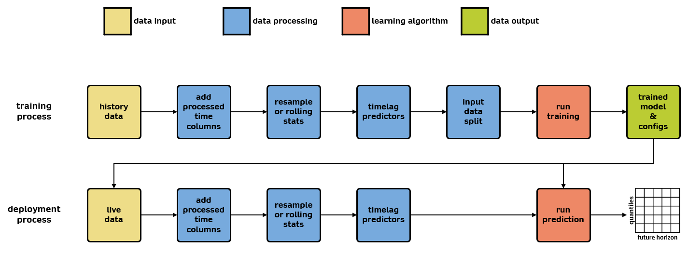

# Configuration Parameters and Options

Schematic below shows the workflow of wattile layered with configuration groups described below.

### data input group

- `data_dir`: *str*

    The directory containing the data config and csv
    
- `data_config`: *TBD*

    TBD
    
- `start_time`: *TBD*

    TBD
    
- `end_time`: *TBD*

    TBD
    
- `predictor_columns`: *List[str]*

    Pre-defined predictor variables
    
- `target_var`: *str*

    Column name and target variable in the input data that model will predict
    
### data processing group

- `DOW`: *list[str] ("binary_reg", "binary_fuzzy")*

    Day of week methodology

- `MOY`: *list[str] ("sincos")*

    Month of year methodology

- `HOD`: *list[str] ("sincos", "binary_reg", "binary_fuzzy")*

    Hour of day methodology

- `Holidays`: *boolean*

    Indicator of whether holidays are taken into consideration in the modeling
    
- `window`: *int*

    Defines numbers of lagged versions of variables. It is also termed as Sequential length
    
- `rolling_window`: *dict*
    - `active`: *boolean*

         specify whether or not to use rolling window statistics

    - `type`: *str ("binned", "rolling")*

        **binned** - This method creates min, max, and mean features for each original feature, computed by calculating the statistic over that last N minutes, separated into 
        stationary bins. This has the same effect as downsampling the data to a lower frequency.
        
        **rolling** - This method creates min, max, and mean features for each original feature, computed by calculating the statistic over that last N minutes in a rolling fashion. The time frequency of the original data is preserved.

    - `mintues`: *int*

        Specifies the number of minutes to use for the window. For type binned, this is the size of the downsampling. This should be higher than configs["resample_freq"], since the rolling windows are calculated after this step. For type rolling, this is the size of the rolling window.
        
- `EC_future_gap_min`: *int*

    Shift the output variable in the unit of minutes, which defines the first forecasting horizon
    
- `sequence_freq_min`: *int*

    The frequency in the unit of minutes to create lagged variables

- `S2S_stagger`: *dict*

    Defines number of timestamps to predict in the future. It is also used for padding in building processing

    - `initial_num`: *int*
    - `decay`: *int*
    - `secondary_num`: *int*
    
- `splicer`: *dict*

    Group datasets together into sequential chunks just for data split

    - `active`: *boolean*

        defines whether splicer is applied

    - `time`: *[pandas.Timedelta](https://pandas.pydata.org/docs/reference/api/pandas.Timedelta.html) str*

        defines the window size of splicer

- `train_size_factor`: *int*

    Ensure to pick a training set size that we can then later split into mini batches that have some desired number of samples in each batch. Purely for computational efficiency

- `data_split`: *str ("x:y:z" where x + y + z = 100)*

    Training, validation, and testing data ratio, respectively

### learning algorithm group

- `arch_version`: *int (4 or 5)*

    Architecture version

- `arch_type_variant`: *str ("vanilla or "lstm")*

    RNN architecture type

- `preprocess`: *boolean*

    Indicator to run data_preprocessing.py

- `fetch_n_parse`: *boolean*

    Indicator to fetch data from the API, get it and put it in a JSON

- `transformation_method`: *str ("minmaxscale" or "standard")*

    Data normalization methods

- `train_batch_size`: *int*

    Size of batch in the training data. It is used to calculate number of batches in the training data

- `val_batch_size`: *int*

    Size of batch in the validation data. It is used to calculate number of batches in the validation data

- `train_val_split`: *str*

    Method to split training and validation data including random

- `random_seed`: *int*

    Random seed to group data into sequential chunks and also the seed number to fix the randomness in torch package

- `qs`: *list[floats]* (floats must be 0-1)

    Quantile list

- `use_case`: *str ("train", "prediction", "validation")*

    **train** - use case for training a model

    **validation** - use case for validating an existing (previously trained) model

    **prediction** - use case for applying data on a trained model for deployment purpose

- `run_resume`: *boolean*

    Indicator to resume from a previous training session

- `num_epochs`: *int*

    Number of epochs

- `weight_decay`: *float*

    Parameter for optimizer

- `hidden_nodes`: *int*

    Hidden nodes

- `layer_dim`: *int*

    Layer dimension

- `eval_frequency`: *int*

    Frequency (every n iterations) to save the model

- `lr_config`: *dict*

    Learning rate configuration

    - `base`: *float*
    - `schedule`: *boolean*
    - `type`: *str*
    - `factor`: *float*
    - `min`: *float*
    - `patience`: *int*
    - `step_size`: *int*
- `smoothing_alpha`: *float*

    Smoothing alpha for pinball loss and quantile loss function

- `test_method`: *str ("external", "internal")*

    Defines the source of testing data, including internal (using training data) or external (using h5 file) 

### data output group

- `exp_dir`: *str*

    Directory  where model output
    
- `plot_comparison`: *TBD*

    TBD
    
- `plot_comparison_portion_start`: *TBD*

    TBD
    
- `plot_comparison_portion_end`: *TBD*

    TBD
