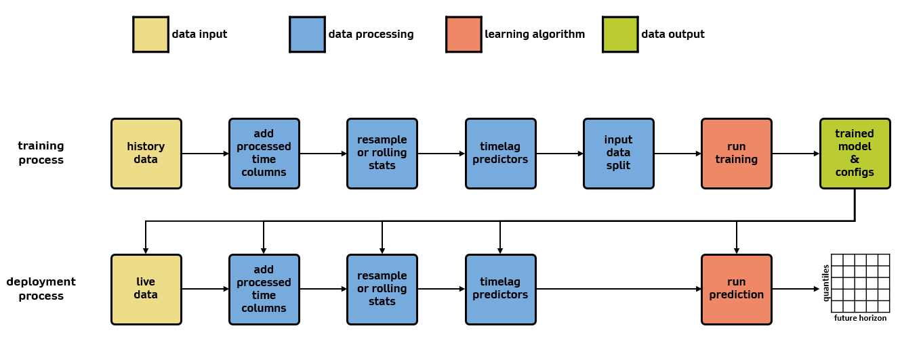

# Configuration Parameters and Options

Schematic below shows the workflow of wattile layered with configuration groups. Descriptions of all configuration parameters under each group are also presented below.

### data input: *dict*

- `data_dir`: *str*

    Directory (e.g., `tests/data/Synthetic Site`) containing the data configuration file and timeseries data in csv.
    
- `data_config`: *str*

    Name (e.g., `Synthetic Site Config.json`) of the data configuration file located under `data_dir`.
    
- `start_time`: *str*

    Start of date and time (e.g., `2018-01-01T00:00:00-07:00`) in ISO (International Organization for Standardization) format. Data before this date and time is dropped before data processing.
    
- `end_time`: *str*

    End of date and time (e.g., `2022-01-01T00:00:00-07:00`) in ISO format. Data after this date and time is dropped before data processing.
    
- `predictor_columns`: *List[str]*

    List of pre-defined predictor variable (or column) names from the input data. Only variables listed in this list are passed to the data processing. If it is an empty list, all predictor variables that were read from the input data are passed to the data processing.
    
- `target_var`: *str*

    Target variable name (or column name) in the input data that model will predict.
    
    
### data processing: *dict*

- `feat_time`: *dict*

    Containing parameters for adding time-based features.

  - `month_of_year`: *list[str] ("sincos")*

      Options for adding month of year feature. If empty, this feature is not added.
      
  - `day_of_week`: *list[str] ("binary_reg", or "binary_fuzzy")*

      Options for adding day of week feature. If empty, this feature is not added.

  - `hour_of_day`: *list[str] ("sincos", "binary_reg", or "binary_fuzzy")*

      Options for adding hour of day feature. If empty, this feature is not added.

  - `holidays`: *boolean*

      Option for adding (or not adding) holiday feature. List of holidays are contained in a separate file shown [here](https://github.com/NREL/Wattile/blob/main/wattile/holidays.py).
      
- `resample`: *dict*

    Containing parameters for resampling raw input data that might have been measured in irregular timestamps with missing data points.

  - `bin_interval`: *pandas timedelta*
  
      Interval (e.g., `15min`) of each bin. 
      
  - `bin_closed`: *str ("left" or "right")*
  
      Which side of the bin interval is closed.
      
  - `bin_label`: *str ("left" or "right")*
  
      Which bin edge label to label the bin with.
      
- `feat_stats`: *dict*

    Containing parameters for adding statistics-based features.

  - `active`: *boolean*
  
      Option for adding (or not adding) statistics-based features. Currently supporting rolling window statistics of minimum, maximum, and mean.
      
  - `window_width`: *pandas timedelta*
  
      Width of the rolling window in time (e.g., `15min`). Enabled only when `active` is `True`.
      
- `feat_timelag`: *dict*

    Containing parameters for adding time-lagged features.

  - `lag_interval`: *pandas timedelta*
  
      Lagging interval (e.g., `15min`) of the time-lagged window.
  
  - `lag_count`: *int*
  
      Total count of time-lagged window shifts. If `lag_interval="15min"` and `lag_count=24`, then additional features include 15 minutes incremental shift and up to 6 hours lag.
    
- `input_output_window`: *dict*

    Containing parameters for properly handling input and output time windows of learning models.

  - `window_width_source`: *pandas timedelta*
  
      Width of the predictor data in time (e.g., `180min`) with respect to the current (or casting) time. This parameter has to be defined as an input to the `charlie` model but not required as an input for `alfa` and `bravo` models. 
      
  - `window_width_futurecast`: *pandas timedelta*

      Width of the future cast in time (e.g., `60min`) with respect to the current (or casting) time. If casting time is 9:00AM and `window_width_futurecast="0min"`, then the timestamp for the first forecast value is 9:00AM. If casting time is 9:00AM and `window_width_futurecast="60min"`, then the timestamp for the first forecast value is 10:00AM. 
      
  - `window_width_target`: *pandas timedelta*
  
      Width of the target data in time (e.g., `45min`) with respect to the current (or casting) time. This parameter has to be defined as an input to the `charlie` model but not required as an input for `alfa` and `bravo` models.
      
- `random_seed`: *int*

    Random seed number to fix the randomness in the workflow: splitting data during data processing and shuffling data in learning algorithm.
    
- `sequential_splicer`: *dict*

    Containing parameters for enabling sequential data splicing. Sequential splicing means when data gets splitted into training, validation, and testing data sets, then each data set retains certain level of continuous data in time.

    - `active`: *boolean*

        Option for enabling (or disabling) sequential splicing.

    - `window_width`: *pandas timedelta*

        Width of continuous sequence (e.g., `1W` as in 1 week).

- `data_split`: *str*

    Split percentages (e.g., "80:10:10") between training, validation, and testing data sets. Format should be "x:y:z" and where x + y + z should equal to 100.
    
- `train_size_factor`: *int*

    Factor to count and split data properly between training, validation, and testing data sets.

### learning algorithm: *dict*

- `arch_type`: *str ("RNN")*

    Learning architecture type. Currently only supporting Recurrent Neural Network (`RNN`).
    
- `arch_version`: *int ("alfa", "bravo", or "charlie")*

    Learning model options. `alfa` outputs multiple quantiles and single future-time-horizon predictions. `bravo` outputs multiple quantiles and multiple future-time-horizon predictions (not sequence to sequence). `charlie` outputs single quantile and multiple future-time-horizon predictions (with sequence to sequence).
    
- `arch_type_variant`: *str ("vanilla", "lstm", or "gru")*

    RNN variant type. This parameter has to be paired properly with learning model types as shown below.
    
    - alfa and bravo models: supporting `vanilla` and `lstm` (long short-term memory).
    - charlie model: supporting `vanilla`, `lstm`, and `gru` (gated recurrent unit).
    
- `use_case`: *str ("train", "prediction", "validation")*

    - `train` - use case for training a model
    - `validation` - use case for validating an existing (previously trained) model
    - `prediction` - use case for applying data on an existing (previously trained) model for deployment purpose
 
- `num_epochs`: *int*

    Number of epochs.
    
- `hidden_size`: *int*

    Number of features in the hidden state. 
   
- `num_layers`: *int*

    Number of recurrent layers.
    
- `quantiles`: *list[floats]*

    List of quantiles (e.g., `[0.025, 0.25, 0.5, 0.75, 0.975]` and 0.5 in the list representing median prediction). Numbers in the list must be within 0-1 and `quantiles` only affects models with multiple quantiles predictions.
    
- `transformation_method`: *str ("minmaxscale" or "standard")*

    Data normalization methods. `minmaxscale` normalizes the data with minimum and maximum values and `standard` normalizes the data with average and standard deviation.
    
- `train_batch_size`: *int*

    Size of batch in the training data. It is used to calculate number of batches in the training data.

- `val_batch_size`: *int*

    Size of batch in the validation data. It is used to calculate number of batches in the validation data.

- `run_resume`: *boolean*

    Indicator to resume from a previous and unfinished training session.

- `weight_decay`: *float*

    Parameter for optimizer.

- `lr_config`: *dict*

    Learning rate configuration. Refer to torch documentation for more details around these parameters related to [optimization algorithm](https://pytorch.org/docs/stable/optim.html).

    - `base`: *float*
    - `schedule`: *boolean*
    - `type`: *str*
    - `factor`: *float*
    - `min`: *float*
    - `patience`: *int*
    - `step_size`: *int*

- `smoothing_alpha`: *float*

    Smoothing alpha for pinball loss and quantile loss function.

- `eval_frequency`: *int*

    Frequency (every n iterations) to save the model.

- `test_method`: *str ("external", "internal")*

    Defines the source of testing data including internal (using training data) or external (using h5 file).

### data output

- `exp_dir`: *str*

    Directory (e.g., "exp_dir") where model output
    
- `plot_comparison`: *boolean*

    Option to enable or disable timeseries comparison plot based on trained model. If enabled, both interactive (in html format) and static (in svg format) plots are created under `exp_dir` location.
    
- `plot_comparison_portion_start`: *float*

    Ratio between 0 and 1 to reduce the size of the data being plotted. The value should be less than the value of `plot_comparison_portion_end`. Using 0 for this parameter means data is plotted from the very beginining and 0.5 means data is plotted from half way to the end (instead of plotting from the beginning). 
    
- `plot_comparison_portion_end`: *float*

    Ratio between 0 and 1 to reduce the size of the data being plotted. The value should be larger than the value of `plot_comparison_portion_start`. Using 1 for this parameter means data is plotted until the very end and 0.5 means data is plotted until half way to the end (instead of plotting until the end).
